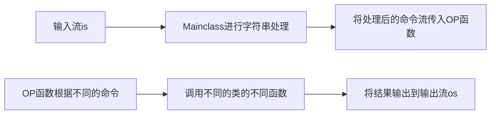
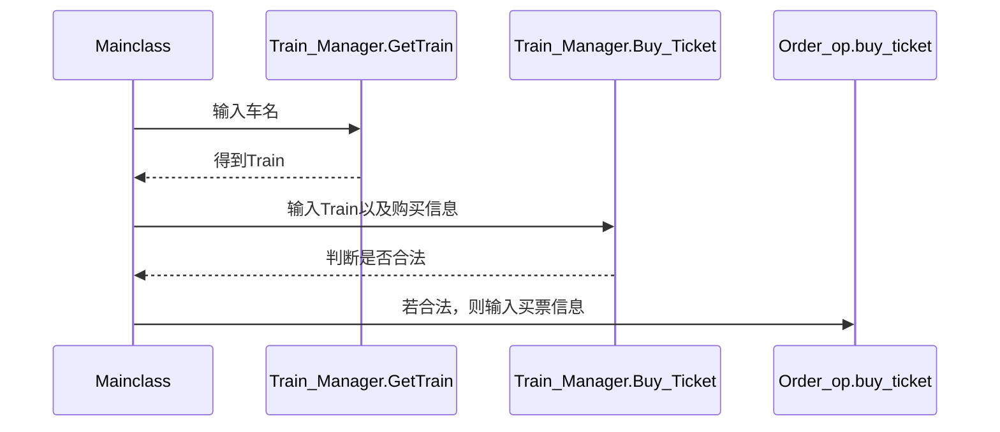

# 火车票大作业

## 贡献者：Ubospica max-blabla

### 下面是后端完成的部分

后端一共有5个文件，他们分别为$Mainclass.hpp,command.hpp,Logging.hpp,Order.hpp,Train.hpp$

- $command.hpp$

  在该hpp中，定义了$Cmd\_Que$类与字符串处理函数，如下所示

  ```C++
   class Cmd_Que{
      private:
          struct data {
              char type;
              std::string _command_part;
          };
          struct Node {
              Node *nxt;
              data _command;
              Node *prev;
              Node(char type, std::string &Val) {
                  nxt = nullptr;
                  prev = nullptr;
                  _command.type = type;
                  _command._command_part = Val;
              }
  
              Node() {
                  nxt = prev = nullptr;
                  _command._command_part = "";
                  _command.type = ' ';
              }
          };
  public:
          Node *head;
          Node *rear;
          int _size;
       	 Cmd_Que(){
              head = new Node;
              rear = new Node;
              head->nxt = rear;
              (rear->_command.type) = '~';
              (rear->_command)._command_part = "^8l,*";
              rear->prev = head;
              _size = 0;
          };
          void insert(char type, std::string &Val);
          const std::string &top()const;
          const char &top_type();
          void pop();
          int size();
          void print();
          ~Cmd_Que();
          void clear();
   };
   void process(Backend::Cmd_Que *Cmd_Strm, std::string & Cmd);
   void read_substr(Backend::Cmd_Que *stream, int n, std::string &command, int &pointer);
  ```

  Command类为用命令队列，将命令中不同成分的含义与内容拆解后置入其中。各个函数含义同队列。

  process函数,先读入$Cmd$中第一个单词，该单词即为不同指令，根据该指令，设置需要拆解单词个数，然后将其传入$read\_substr$函数中，在该函数中，将会读取指定个数的单词并置入$stream$中；若为不定长命令，则会在$process$函数中将不定长命令解析，并置入$Cmd\_Que$中。

  ```c++
  void process(Backend::Cmd_Que *Cmd_Strm, std::string & Cmd);
  void read_substr(Backend::Cmd_Que *stream, int n, std::string &command, int &pointer);
  ```

* $Mainclass.hpp$

  在该hpp中，定义了$Main$类，如下所示

  ```C++
  Class Main{
  private:
  	Order_op order_op;
  	Train_manager train_op;
  	Log_op log_op;
  	void buy_ticket(Cmd_Que * cmd,std::ostream & os);
      void query_order(Cmd_Que * cmd,std::ostream & os);
      void refund_ticket(Cmd_Que * cmd,std::ostream & os);
      void release_train(Cmd_Que * cmd,std::ostream & os);
      void delete_train(Cmd_Que * cmd,std::ostream & os);
      void query_transfer(Cmd_Que * cmd,std::ostream & os);
      void query_ticket(Cmd_Que * cmd,std::ostream & os);
      void add_train(Cmd_Que * cmd,std::ostream & os);
      void query_train(Cmd_Que * cmd,std::ostream & os);
      void login(Backend::Cmd_Que *cmdQue,std::ostream & os);
      void logout(Backend::Cmd_Que *cmdQue,std::ostream & os);
      void modifyprofile(Backend::Cmd_Que *cmdQue,std::ostream & os);
      void adduser(Backend::Cmd_Que *cmdQue,std::ostream & os);
      void queryprofile(Backend::Cmd_Que *cmdQue,std::ostream & os);
      void clean(Backend::Cmd_Que *cmdQue,std::ostream & os);
      void end(Backend::Cmd_Que *cmdQue,std::ostream & os);
      void OP(Backend::Cmd_Que *cmdQue,std::ostream & os);
       int stringtoint(const std::string & str);
  public:
      explicit Main():log_op(_BPT_user_name),train_op(_BPT_Train_name,
      _BPT_station_name,_BPT_Rl_name,_BPT_seat_name,_Count_name),
      order_op(_BPT_order_name,_BPT_queue_name,_BPT_Train_Index_name){};
      void Run(std::istream & is,std::ostream & os);
  }
  ```

  私有成员为分管不同部分的类，以及对这些类进行操作的函数，这些函数将$cmdQue$中的字符串转换为不同的参数，并调用成员类提供的函数，根据成员类结果输出0或-1。

  OP函数操作为识别$cmdQue$中的命令，根据命令选择调用不同私有函数。

  ```C++
   void OP(Backend::Cmd_Que *cmdQue,std::ostream & os);
  ```

  下面是几个公有函数成员

  显示构造函数

  ```C++
  explicit Main():log_op(_BPT_user_name),train_op(_BPT_Train_name,
      _BPT_station_name,_BPT_Rl_name,_BPT_seat_name,_Count_name),
      order_op(_BPT_order_name,_BPT_queue_name,_BPT_Train_Index_name){};
  ```

  Run函数为对外的接口，从$is$中读入字符串，然后创建$cmdQue$对象，并调用$command.hpp$中提供的$process$函数，得到分析后的$cmdQue$对象，并将其传入OP函数中

  ```C++
     void Run(std::istream & is,std::ostream & os
  ```

* $Logging.hpp$

  在该hpp中，定义了枚举类user\_parameter,以及user, BPT\_insert\_user, Log_op

  ```C++
   enum class user_parameter{
          Passwd,
          Name,
          MailAddr,
          Username
      };
      class user{
      private:
          Ticket::String<24> username;
          Ticket::String<35> passwd;
          Ticket::String<25> name;
          Ticket::String<35> mailAddr;
          int privilege=0;
      public:
          user()=default;
  
          explicit user(const Ticket::String<24> & Name):username(Name){};
  
          Ticket::String<24> get_user_name();
  
          const Ticket::String<24> get_user_name()const;
  
          const int & get_privilege()const;
  
          void set_str(user_parameter kind,const std::string & change);
  
          void set_pri(int pri);
  
          bool passwd_match(const Ticket::String<35> & password);
  
          void print(std::ostream & os);
  
          ~user()=default;
      };
  
      class BPT_insert_user{
      private:
          Ticket::BPlusTree<size_t,user> _BPT_user;
      public:
          explicit BPT_insert_user(std::string & filename):_BPT_user(filename){};
  
          bool add_user(user & data);
  
          user find_user(const size_t & username);
  
          void modify_user(const user& Nuser);
  
          int size();
  
          void clean();
  
          ~BPT_insert_user()=default;
      };
      class Log_op{
      private:
          BPT_insert_user op_user;
          Backend::map<size_t,int> _logging_list;
      public:
          explicit Log_op(std::string  & filename):op_user(filename){};
  
          bool is_log(const size_t & username);
  
          bool login(const size_t & user_name,const Ticket::String<35> & passwd);
  
          bool logout(const size_t & username);
  
          bool show_user(const size_t & op_name,const size_t & username,std::ostream & os);
  
          bool modify(const size_t & op_name,const bool * kind,const size_t & change,std::string * strs,int pri,std::ostream & os);//0 是密码 1是名字 2是邮箱 3是权限
  
          bool add_user(const size_t & op_name,const Ticket::String<24> & user_name,const std::string & password,const std::string & name,const std::string & mailAddr,const int & pri);
  
          void clean();
  
          ~Log_op()=default;
      };
  
  }
  ```

  其中user类为基础，包含user的信息，并提供输出函数。

  $BPT\_insert\_user$类为封装的BPT，用于进行用户操作并判断该操作正确性。

  $Log\_op$内包含了登陆栈和封装后的BPT，提供对$Mainclass$的接口，并判断操作正确性。

* $Train.hpp$

  包含Train\_manager类

  ```C++
      class Train_manager {
      public:
          struct Train {
              Ticket::String<24> Train_SN;
              Ticket::Date start_day;
              Ticket::Date end_day;
              Ticket::Date start_time;
              int station_num = 0;
              char type='\0';
              int seat=0;
              struct info {
                  Ticket::String<36> station;
                  Ticket::Date Sta_Date;//仅代表日期的起终
                  Ticket::Date End_Date;//
                  Ticket::Date depart_time;
                  int prefix_price = 0;
                  int prefix_time = 0;
                  int stopover = 0;
              };
              info train_info[100];
          };
  
      private:
  
          struct Station {
              int index=0;
              int Pos = 0;
  
              Station() = default;
  
              Station(const int & Index, const int &pos) {
                  index =Index ;
                  Pos = pos;
              }
  
          };
  
          struct Seat_Key {
           size_t time;
           size_t train;
              Seat_Key() = default;
              Seat_Key(size_t & hashtime,size_t & hashtrain) {
                  time = hashtime;
                  train = hashtrain;
              }
  
              bool operator==(const Seat_Key &r) const {
                  return time == r.time && train == r.train;
              }
  
              bool operator<(const Seat_Key &r) const {
                  return train < r.train||(train==r.train&&time<r.time);
              }
  
          };
          struct Station_Key {
             int hashStation;
              int pos = 0;
              bool operator==(const Station_Key &r) const {
                  return hashStation == r.hashStation && pos == r.pos;
              }
              bool operator<(const Station_Key &r) const {
                  return hashStation < r.hashStation || (hashStation == r.hashStation && pos < r.pos);
              }
          };
          struct Station_Comp {
              bool operator()(const Station_Key &l, const Station_Key &r) {
                  return l.hashStation < r.hashStation;
              }
          };
          struct Seat{
              int seatarr[100]={0};
          };
  
          Ticket::BPlusTree<Seat_Key,Seat> _BPT_Seat;
          Ticket::BPlusTree<size_t, Train> _BPT_Train;
          Ticket::BPlusTree<Station_Key, Station> _BPT_Station;
          Ticket::BPlusTree<size_t, char> _BPT_Rl;
          Ticket::FileIONoCache Count;
          int cnt = 0;
          int
          _get_seat_range(const Ticket::String<24> &Train_ID, const Ticket::Date &Start_Date, int & sta,
                          int & end,const int & sup) {
              Ticket::Date Datekey(Start_Date.transToDate());
              Seat_Key seatKey;
              seatKey.train = hash(Train_ID);
              seatKey.time=Ticket::hash(Datekey.getDateStr());
              int seat = sup;
              int seatpos=_BPT_Seat.find(seatKey);
              Seat seatarr=_BPT_Seat.getVal(seatpos);
              for (int i = sta; i < end; i++)  {
                  seat = std::min(seat, seatarr.seatarr[i]);
              }
              return seat;
          }
          struct Comp {
              int data = 0;
              int pos = 0;
              Ticket::String<24> ID;
              bool operator<(const Comp &o) const {
                  return data < o.data || (data == o.data && ID < o.ID);
              }
          };
          struct Trans_Comp {
              Ticket::String<24> Train_ID_Sta;
              Ticket::String<24> Train_ID_End;
              Ticket::String<36> Cent;
              int num=0;
              int diff1=0;
              int diff2=0;
              int price1=0;
              int price2=0;
              int sta1=0;
              int sta2=0;
              int end1=0;
              int end2=0;
              Ticket::Date depart1;
              Ticket::Date depart2;
              Ticket::Date Start_Date1;
              Ticket::Date Start_Date2;
              bool operator<(const Trans_Comp &o) const {
                  return num < o.num || (num == o.num && diff1<o.diff1);
              }
          };
  
      public:
          explicit Train_manager(const std::string &name, const std::string &station_name, const std::string &Rlname, const std::string &seat_name, const std::string &count) : _BPT_Train(name),                                                           _BPT_Station(station_name),
                              _BPT_Rl(Rlname),                                                             _BPT_Seat(seat_name) {
              Count.open(count);
              if (Count.isFirstOpen()) cnt = 0, Count.write(Count.BEG, cnt);
              else Count.read(Count.BEG, cnt);
          };
          
          bool add_train(const Ticket::String<24> &SN, int &stanum, int &seatnum, Ticket::String<36> *stations, const int *price, const Ticket::Date  &sta_time, const int *traveltime, const int *stoppovertime, const Ticket::Date *saleDate, char type);
          
          bool delete_train(const size_t & hashSN);
          
          bool release_train(const size_t & hashSN);
          
          bool query_train(const size_t & hashSN, const Ticket::Date &tDate, std::ostream &os);
          
          bool query_ticket(const Ticket::String<36> &Sta, const Ticket::String<36> &Det, const Ticket::Date &date, char type, std::ostream &os);
          bool query_transfer(const Ticket::String<36> &Sta, const Ticket::String<36> &Det, const Ticket::Date &date, char type, std::ostream &os);
          
          bool GetTrain(Train &data, const Ticket::String<24> &ID);
          
          void BuyTicekt(Train &data, Ticket::Date &Start_Date, Ticket::Date &End_Date, const Ticket::String<36> &Sta, const Ticket::String<36> End, int &sta, int &end, int &seat, int &price, int nums);
          
          void RenewN(Train &Aim, std::vector<order> &TrainOrdervec, Ticket::vector<OrderKey> &Renewvec, order &Success);
  
           void clean();
          
          ~Train_manager();
  }
  		
  ```

  其中包含有四个B+树，分别是从火车名到火车全部信息的B+树，站名到站点信息的B+树，站名到火车是否释放的B+树，以及存每天每一辆车的所有座次信息的B+树。

  其中Train结构体为火车全部信息；Station\_key结构体包含站名以及一个标识数，作用是为了找到所有站名相同但标识数不同站点信息，用于区分不同车；Station为该站对应车在文件中绝对位置以及该站在车次中的下标; Seat\_key结构体为火车名以及火车起始站始发时间，其中Seat结构体包括100个int，即代表座次。Trans_Comp为Query_Transfer函数中使用的结构体。

  其中$RenewN, BuyTicket, GetTrain$函数为实现需要跨类操作提供的功能函数，具体作用见下方文档。而其它函数均为该类内操作函数。

* $Order.hpp$

  包含Order，waiting_queue, BPT_order, Order_op类

  ```c++
   struct OrderKey{
          size_t hashstr;
        //  Ticket::String<24> str;
          int SN=0;
          bool operator<(const OrderKey & r)const{
              return hashstr<r.hashstr||(hashstr==r.hashstr&&SN<r.SN);
          }
          bool operator==(const OrderKey & r)const{
              return hashstr==r.hashstr&&SN==r.SN;
          }
          bool operator!=(const OrderKey & r)const{
              return hashstr!=r.hashstr||SN!=r.SN;
          }
      };
      enum class order_parameter {
          Username,
          Train_ID,
          Start_Date,
          End_Date,
          SN,
          Num,//Num为Ticketnum
          Price,
          Start,
          End,
          Start_Position,
          End_Position
      };
      enum class state_list {
          Null,
          Success,
          Pending,
          Refund,
          //Error
      };
  
      class order {
          // friend  std::ofstream & operator<<(order & o,ofstream & os);
      private:
          state_list _state;
          Ticket::String<24> user_name;
          Ticket::Date End_date;
          Ticket::Date Sta_date;//购买时间
          Ticket::String<24> train_ID;
          Ticket::String<36> Sta;
          int sta=0;
          Ticket::String<36> Det;
          int det=0;
          int ticket_num=0;
          int price=0;
          int serial_number=0;
      public:
          order() {
              _state = state_list::Null;
              //   serial_number = ++order_op._order_num;
          }
  };
  class waiting_queue {
      private:
          struct Comp {
              bool operator()(const OrderKey &l,const OrderKey &r)const {
                  return l.hashstr < r.hashstr;
              }
          };
          Ticket::BPlusTree<OrderKey, order> Waiting_Queue;
          Ticket::BPlusTree<OrderKey,order> Train_Queue;
      public:
          explicit waiting_queue(const std::string &name,const std::string & Trainfilename) : Waiting_Queue(name) ,Train_Queue(Trainfilename){};
  
          void insert(const Ticket::String<24> &name,const Ticket::String<24> & Train_ID, int SN, order &order);
  
          void Renew(std::vector<OrderKey> &IDvec,const Ticket::String<24> & Train_ID);
      
          void refund(int SN,const Ticket::String<24>& name,const Ticket::String<24>& Train_ID);
      
          void GetPending(const Ticket::String<24> & Train_ID, std::vector<order> & TrainOrdervec);
  
          void clean();
      };
  
      class BPT_order {
      private:
          //int _order_num;
          struct Comp {
              bool operator()(const OrderKey &a, const OrderKey &b)const {
                  return a.hashstr < b.hashstr;
              }
          };
          Ticket::BPlusTree<OrderKey, order> _BPT_Name_order;
          
      public:
          explicit  BPT_order(const std::string &filename) : _BPT_Name_order(filename) {};
         
          int insert(order &data);
  
          Ticket::vector<order> query(const Ticket::String<24> &user_name);
  
          bool refund(const Ticket::String<24> &name, int n, order & Success, OrderKey & Pending,Ticket::String<24> & Train_ID,char & type,int & SN);
  
          int size();
  
          void Renew(std::vector<OrderKey> & Renewvec);
  
          
          void clean();
          
          ~BPT_order() = default;
      };
  class Order_op {
      private:
          waiting_queue Que;
          BPT_order Order;
      public:
          explicit Order_op(const std::string & order,const std::string & queue,const std::string & TrainIndex):Order(order),Que(queue,TrainIndex){};
  
          bool refund(Ticket::String<24> & Train_ID,const Ticket::String<24> & name, int n,order & Success ,std::vector<order> & TrainOrdervec,char & type);
      	
  
       	void query_order(const Ticket::String<24> &name,std::ostream& os);
      
          void renew(std::vector<OrderKey> & Renewvec,const Ticket::String<24> & Train_ID);
  
          void query_order(const Ticket::String<24> &name,std::ostream& os);
       
       	void clean();
       
          void buy_ticket(const std::string &name, const std::string &train_ID, const Ticket::Date & Sta_date, const Ticket::Date & End_date, const Ticket::String<36> &Sta, Ticket::String<36> &Det, int &sta, int &end, int n, int &price, bool state);
   };
  
  ```

  其中Order为基础订单信息，OrderKey为查找所用的Key，用于所有该hpp下的BPT

  Waiting_Queue类包含了两个BPT，一个为人名到订单的BPT，一个为火车站名到订单的BPT，

  当有订单进入排队时，会同时加入这两个BPT，同理，删除的时候两个BPT都会删除。

  BPT_order类包含了人名到订单的BPT，主要进行订单的管理。

  而这两个类之间有一些函数用于彼此交流。

  Order_op为总的对外接口类，提供接口函数，内置如上两个类，进行一些基本操作。

下面展示的是部分函数具体操作

- 总体概览



- Query_Ticket函数(大多数函数和它差不多)

  ```mermaid
  graph LR
  Mainclass-->处理后的参数传入Train_Manager中
  处理后的参数传入Train_Manager中-->调用Train_Mangager的query_train函数
  ```

- Buy_Ticket函数



- Refund函数

- ```mermaid
  sequenceDiagram
  Mainclass->>Order_op.Refund:输入人名与n
  Order_op.Refund->>BPT_order.refund:输入人名与n
  BPT_order.refund-->>Order_op.Refund:根据人名处理并将结果返回
  Order_op.Refund->>waiting_queue.refund:如果退票为Pending，则将其从等待队列中去掉
  Order_op.Refund->>waiting_queue.GetPending:如果退票为Success，则得到所有该票对应火车的在等待队列中的票
  waiting_queue.GetPending-->>Order_op.Refund:传出等待更新的票的vectorA
  Order_op.Refund-->>Mainclass:若退订为Success，传回退掉的订单信息以及vectorA
  Mainclass->>Train_Manager.RenewN:对所有vectorA中订单执行更新操作
  Train_Manager.RenewN-->>Mainclass:对成功更新的订单信息加入vectorB中
  Mainclass->>Order_op.renew:对所有vectorB中订单进行更新，从等待队列中除去这些订单并在订单文件中改为Success
  
  
  ```